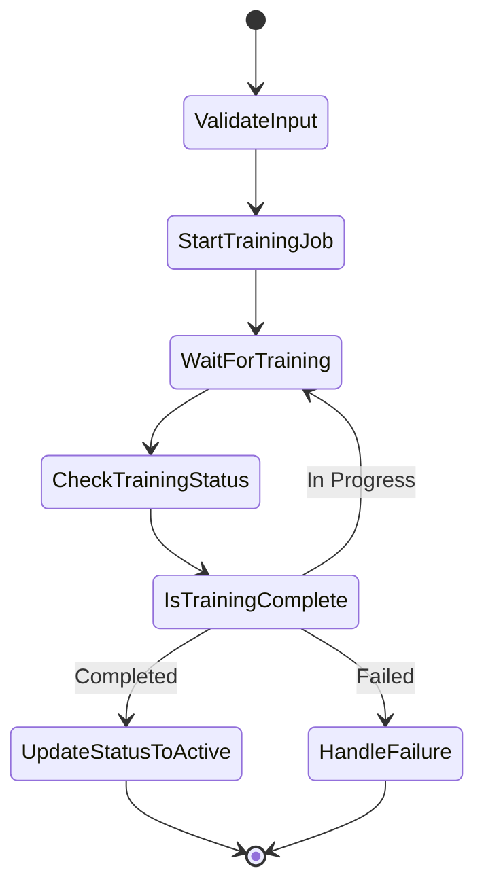

# Iteration 2: Core Asynchronous Workflow & API Security

## 🏗️ Architecture Overview

This iteration establishes the **blended Vercel/AWS serverless architecture** with centralized security and asynchronous AI workflows.

### Backend Architecture

```
┌─────────────────┐    ┌──────────────────┐    ┌─────────────────┐
│   Frontend      │    │   Vercel API     │    │   AWS Backend   │
│   (Vite/React)  │───▶│   Functions      │───▶│   Step Functions│
└─────────────────┘    └──────────────────┘    └─────────────────┘
                                │                        │
                                ▼                        ▼
                       ┌──────────────────┐    ┌─────────────────┐
                       │   Supabase DB    │    │  Lambda Funcs   │
                       │   (PostgreSQL)   │    │  + Authorizer   │
                       └──────────────────┘    └─────────────────┘
```

## 🔐 Security Model

### Centralized JWT Authorization
- **Lambda Authorizer** validates all AWS API requests
- **JWKS-based verification** using Supabase's public keys
- **Stateless authentication** - no shared secrets
- **Role-based access control** embedded in JWT claims

### Request Flow
1. Frontend gets JWT from Supabase Auth
2. Request sent to Vercel API function
3. Vercel triggers AWS Step Function
4. API Gateway validates JWT via Lambda Authorizer
5. Step Function executes with user context

## ⚡ Asynchronous Workflows

### Digital Twin Creation Workflow



### Key Components

1. **Vercel API Trigger** (`/api/digital-twins/create.py`)
   - Receives frontend requests
   - Validates input
   - Starts AWS Step Function
   - Returns job_id for tracking

2. **AWS Step Function** (`create-digital-twin.json`)
   - Orchestrates AI training workflow
   - Handles retries and error states
   - Updates database status in real-time

3. **Lambda Functions**
   - `validate_input.py` - Input validation
   - `start_training_job.py` - SageMaker integration
   - `check_training_status.py` - Status polling
   - `update_status.py` - Success handling
   - `handle_failure.py` - Error handling

## 🔄 Frontend Integration

### Async Operation Hook
```typescript
const { state, execute } = useAsyncOperation(
  apiClient.createDigitalTwin,
  {
    onSuccess: (data) => console.log('Training complete!'),
    onError: (error) => console.error('Training failed:', error)
  }
);
```

### Real-time Updates
- **Supabase Realtime** subscriptions for status changes
- **Optimistic UI updates** for immediate feedback
- **Progress tracking** with polling mechanism

## 🚀 Deployment

### AWS Infrastructure
- **SAM Template** for infrastructure as code
- **CloudFormation** stack management
- **Multi-environment** support (dev/staging/prod)

### Deployment Commands
```bash
# Deploy AWS backend
cd aws/deployment
./deploy.sh dev

# Deploy Vercel frontend
vercel --prod
```

## 📊 API Endpoints

### Vercel Functions
- `POST /api/digital-twins/create` - Start AI training
- `POST /api/campaigns/create` - Create campaign
- `GET /api/jobs/{id}/status` - Check job status

### AWS API Gateway
- Protected by Lambda Authorizer
- Triggers Step Functions
- Returns execution ARNs

## 🔍 Monitoring & Observability

### AWS CloudWatch
- Step Function execution logs
- Lambda function metrics
- API Gateway request tracking

### Error Handling
- Comprehensive error states in Step Functions
- Graceful degradation in frontend
- User-friendly error messages

## ✅ Verification Checklist

- [ ] AWS Step Function deployed and functional
- [ ] Lambda Authorizer validates JWT tokens
- [ ] Vercel API functions trigger AWS workflows
- [ ] Frontend handles async operations gracefully
- [ ] Real-time status updates working
- [ ] Error handling comprehensive
- [ ] Security policies enforced

## 🔄 Next Steps (Iteration 3)

- Implement React Query for server state management
- Build reactive company onboarding UI
- Add optimistic updates and real-time subscriptions
- Implement dark mode and SEO optimization